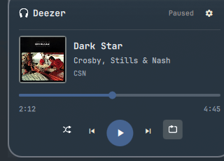
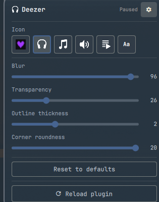

# OmaDeezer

A Deezer now-playing bar widget and popup player for [Omarchy](https://omarchy.org/), built as a Quickshell shell plugin.

 

## Features

- Bar widget showing the current Deezer track via MPRIS, with play/pause, next/previous
- Click to open a popup with album art, a live seek bar, shuffle, and repeat (off → repeat playlist → repeat track)
- Popup colors are extracted from your wallpaper's dominant colors and update automatically when you change wallpaper, with text kept legible against whatever color that produces
- Settings panel (gear icon) with live sliders for blur, transparency, outline thickness, and corner roundness, plus reset-to-defaults and a manual reload button
- 6 bar icon choices: logo, headphones, music note, speaker, playlist, or a text label (title + artist)

## Requirements

- [Omarchy](https://omarchy.org/) with its Quickshell-based shell
- The official Deezer desktop app running, exposing an MPRIS interface identifying as "Deezer" (this is how the widget finds the player - it doesn't talk to the Deezer web API)

## Install

```bash
omarchy plugin add https://github.com/Deunnis/OmaDeezer.git --enable
```

By default it's placed on the right side of the bar; move it with:

```bash
omarchy bar move io.github.OmaDeezer --section right
```

(or place it via `~/.config/omarchy/shell.json`, which is where all the settings below are also stored per-widget).

## Uninstall

```bash
omarchy plugin remove io.github.OmaDeezer
```

## Settings

Available from the gear icon inside the popup:

| Setting | Range | Description |
|---|---|---|
| Icon | 6 options | What's shown on the bar and as the popup header icon |
| Blur | 0-100 | Backdrop blur behind the popup (this is a global Hyprland decoration setting, not scoped to just this popup) |
| Transparency | 0-100 | How see-through the popup background is |
| Outline thickness | 0-6px | Popup card border width |
| Corner roundness | 0-20px | Popup card corner radius |

"Reset to defaults" restores all of the above. "Reload plugin" does a full reload if the widget ever looks stuck.

## Not included

Browsing/shuffling playlists and albums from the popup was attempted but removed - it requires Deezer's app API, and Deezer isn't accepting new API app registrations at the moment. Worth revisiting if that changes.

## License

MIT - see [LICENSE](LICENSE).
